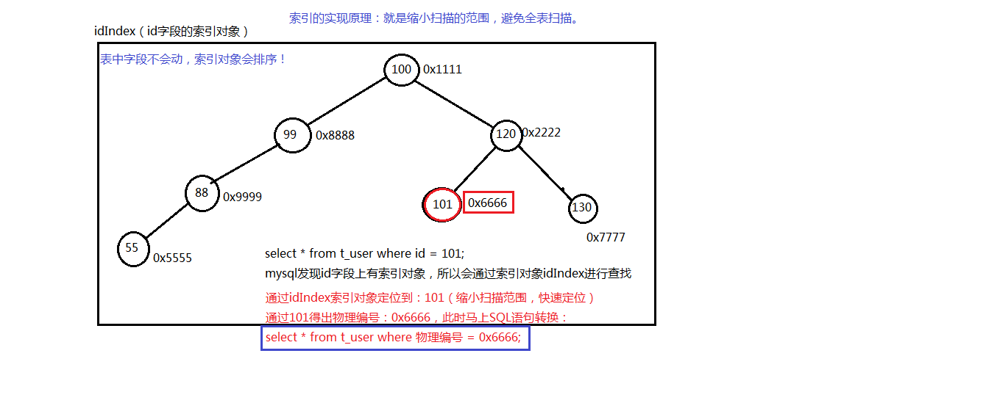

# MySQL
[学习视频](https://www.bilibili.com/video/BV1Vy4y1z7EX?spm_id_from=333.788.videopod.episodes&vd_source=15928c34608bc5de5fee0e613999a322)
[提供测试的数据库表](./bjpowernode.sql)

数据库中最基本的单元是表： table
	行（row）：被称为数据/记录
	列（column）：被称为字段
每个字段都有：字段名、数据类型、约束等属性

### 常用命令
不区分大小写
+ show databases; 
+ show tables;
+ use <name>; 
+ create database <name>; 
+ select database()；
+ select  *  from <tablename>;
+ source <path>; 添加sql到数据库中
+ desc <tablename>;看表结构
+ select version();查看版本号
+ exit

### SQL语句的分类
+ DQL：
	数据查询语言（凡是带有select关键字的都是查询语句）
	select...
+ DML：
	数据操作语言（凡是对表当中的数据进行增删改的都是DML）
	insert
	delete
	update
+ DDL：
	数据定义语言（凡是带有create、drop、alter的都是DDL）
	DDL主要操作的是表的结构，不是表中的数据。
	create
	drop
	alter
+ TCL：
	事务控制语言
	包括：
		事务提交：commit;
		事务回滚：rollback;
+ DCL：
	数据控制语言
	例如：授权grant、撤销权限revoke
	
### DQL
#### 简单查询
+ select 字段名 from 表名;
	其中要注意：
		select和from是关键字
		字段名和表名是标识符
+ select 字段名, 字段名 from 表面;两个字段名间用“ ，”隔开
+ select * from 表名;
#### 列(column)起别名
+ select 字段名 as 别名 from 表名；
	用as关键字起别名
	注意：只是显示列名为别名，不修改原表列名
	且as可以省略为空格
#### 列参参与计算
+ select 字段名 * 数字 from 表名;
#### 条件查询
+ select 字段1，字段2，字段3...from 表名 where 条件;
  = 等于
  <> 或 ！= 不等于
  < 小于
  <= 小于等于
  \> 大于
  \>= 大于等于
  between ... and ... 两个值之间( >= and <=)
  	注意：必须左小右大
  is null 为 null(is not null 不为空)
  	注意：在数据库当中null不能使用等号进行衡量
  and 并且
  or 或者
  	优先级：and的优先级比or高，需要加括号
  in 包含，相当于多个or(not in 不在这个范围中)
  	注意：in不是区间，是具体的值
  like 模糊查询，支持%或下划线匹配
  	%和_是特殊符号，%:任意多个字符，_:任意一个字符
	\转义字符
#### 排序
+ select 字段名 from 表名 order by 字段名; 默认升序
+ select 字符名 from 表名 order by 字段名 desc; 指定降序
+ select 字符名 from 表名 order by 字段名 asc; 指定升序
按多个字段排序
+ select 字符名 from 表名 order by 字段名1 asc, 字段名2 asc;
	字段名1起主导作用
+ select 字符名 from 表名 order by 2;
	按照查询结果的第二列排序，不建议使用，因为列顺序会变

**注意**
select ... from ... where ... order by ...关键字顺序不能变
执行顺序 1.from 2.where 3.select 4.order by

#### 数据处理函数（单行处理函数）
特点：一个输入对应一个输出
和单行处理函数相对应的是：多行处理函数（多行处理函数：多个输入对应一个输出）
+ lower 转成小写
+ upper 转成大写
+ substr 取子串
	substr(字段名, 1, n)注意:起始下标为1
+ concat 进行字符串的拼接
	concat(字段名1, 字段名2)
+ length 取长度
+ trim 去空格
	trim(‘   名称’)
+ str_to_date
	将字符串varchar类型转换成date类型
+ date_fromat
	将date类型转化为一定格式的varchar字符串类型
+ format 设置千分位
	format(字段名, 2) 保留两位小数
+ case..when..then..when..then..else..end
	注意：不修改数据库，只是将查询结果显示修改
+ round 四舍五入
	select 'abc'/1000 from 表名; select后面跟字面值
    +-----+
    | abc |
    +-----+
    | abc |
    | abc |
    | abc |
    +-----+（表里有几个记录就有几行） 
    select round('12346.567', 0) from emp; 保留整数位
+ rand() 生成随机数
+ ifnull 可以将null 转换成一个具体值
	ifnull是空处理函数，专门处理空的
	在所有数据库中，只要有null参与的数学计算，结果都是null
	ifnull(数据, 被当作哪个值)
+ timestampdiff(year, 数据, now())

#### 多行处理函数（分组函数）
特点：输入多行，最终输出一行
+ count
+ sum
+ avg
+ max
+ min
注意：
	分组函数在使用的时候必须先进行分组，然后才能用
	如果你没对数据进行分组，整张表默认为一组
	第一点：分组函数自动忽略null，你不需要提前对null进行处理
	第二点：分组函数中count(*) 和count(具体字段名)的区别
		count(具体字段名)表示统计该字段下所有不为NULL的元素的总数
		count(*)表示统计表的总行数
	第三点：分组函数不能直接使用在where子句中
		因为where先执行，还未进行分组，所以不能使用分组函数
	第四点：所有的分组函数可以组合起来一起用
	
#### 分组查询（非常重要）
+ select ... from ... group by ...

**注意**
select ... from ... where ... group by... order by ...关键字顺序不能变
执行顺序 1.from 2.where 3.group by 4.select 5.order by

+ select 字段名 from 表名 group by 字段名;
注意：
	在一条select语句中，如果有group by语句的话，
	select后面只能跟：参加分组的字段，以及分组函数。其它一律不跟
	如果两个字段联合分组则group by 字段名1,字段名2；

+ select 字段名 from 表名 group by 字段名 having 条件;
having 必须和group by 一起用，无法替代where
优化策略：where和having，优先选择where。只有在where不行的时候才使用having

**总结**
select ... from ... where ... group by... having... order by ...关键字顺序不能变
执行顺序 1.from 2.where 3.group by 4.having 5.select 6.order by

1. 从某张表中查询数据
2. 通过where条件筛选有价值的数据
3. 对有价值的数据进行分组
4. 分组后可以用having条件继续分组
5. select查询出来
6. 最后排序输出

#### 连接查询（最重要）
从一张表中单独查询，称为单表查询
多张表连接起来查询数据，从一张表中取一个字段，另一个表取另一个字段，称为连接查询

分类：
	年代分类：
		SQL92
		SQL99
	表连接的方式分类：
		内连接
			等值连接
			非等值连接
			自连接
		外连接
			左外连接（左连接）
			右外连接（右链接）
		全连接

当两张表进行连接查询， 没有任何条件限制的时候，最终查询的结果条数条数是两张表条数的乘积，这种现象被称为：笛卡尔积现象
即前一张表的每一行都对应后一张表的全部行
注意：根据笛卡尔积现象，表的连接次数越多效率越低，尽量避免表的连接次数

避免笛卡尔积现象：加连接条件
select 字段名 from 表名 where 表名1.字段名 = 表名2.字段名;
但这样并不会减少匹配次数，还是两张表条数的乘积
优化：例如select e.ename, d.dname from emp e, dept d where e.deptno = d.deptno;可以提高查询效率即不用取没有该字段名的表中找对应的字段名，不会减少匹配次数（SQL92语法）

##### 内连接之等值连接
SQL92语法：
```sql
	select
		e.ename, d.dname
	from
		emp e, dept d
	where
		e.deptno = d.deptno;
```
SQL92的缺点：结构不清晰，表连接条件和后期进一步筛选的条件，都放在where后面

SQL99语法：
```sql
	select
		e.ename, d.dname
	from
		emp e
	join 
		dept d
	on
		e.deptno = d.deptno;
```
```sql
	//inner可以省略
	select
		e.ename, d.dname
	from
		emp e
	inner join
		dept d
	on
		e.deptno = d.deptno; //条件是等值关系，所以叫等值连接
```
SQL99的有点：表连接条件是独立的，连接后如果需要进一步筛选，再往后加where

+ select ... from a join b on a和b的连接条件 where...

##### 内连接之非等值连接
条件不是一个等值连接，所以叫非等值连接
+ select ... from a join b on ... between ... and ...

##### 内连接之自连接
技巧：一张表看成两张表
```sql	
	select
		a.ename as '员工名', b.ename as '领导名'
	from
		emp a
	join
		emp b
	on
		a.mgr = b.empno;
```

##### 外连接
内连接的特点：完全能够匹配的这个条件的数据查询出来（A和B没有主次关系）
外连接的特点：A和B有主次关系
```sql
select
	e.ename, d.dname
from 
	emp e
right outer join
	dept d
on
	e.deptno = d.deptno;
//outer是可以省略，带着可读性强
```
right代表将join关键字右边的这张表看成主表，主要是为将这张表的数据全部查询出来，带着关联查询左边的表
带有right的是右外连接又叫做右连接
带有left的是左外连接右加左连接

##### 三张表，四张表的连接
+ select ... from a join b on a和b的连接条件 join c on a和c的连接条件 join d on a和d的连接条件
一条sql中内连接和外连接都可以混合。
```sql
select
	a.ename as emp, b.ename as leader, d.dname, a.sal, s.grade
from
	emp a
left join
	emp b
on
	a.mgr = b.empno
join
	dept d
on
	a.deptno = d.deptno
join
	salgrade s
on
	a.sal between s.losal and s.hisal;
```

#### 子查询
select语句中嵌套select语句，被嵌套的select语句被称为子查询
+ select ...(select) from ...(select) where ...(select)
1. where后面的子查询
```sql
	select ename, sal from emp where sal > (select avg(sal) from emp);
```
2. from后面的子查询
```sql
select
	t.*, s.grade
from
	(select job, avg(sal) as avgsal from emp group by job) t
join    
	salgrade s
on
	t.avgsal between s.losal and s.hisal;
```
3.select后面出现的子查询（不常用）
```sql
select
	e.ename, (select d.dname from dept d where e.deptno = d.deptno) as dname
from 
	emp e;
```
注意：对于select后面的子查询来说，这个子查询只能一次返回一条结果，否则报错

#### union合并查询结果集
+ select ... from ... union select ... from ...
union的效率要高一些，对于表连接来说，每次连接新表，则匹配次数成倍的翻
但是union可以减少匹配次数，还能完成结果集的拼接

a 连接 b 连接 c
a 10次记录
b 10次记录
c 10次记录
匹配次数：1000次
而union则是(a 连接 b) + (a 连接 c)则是200次

注意：union在进行结果集合并的时候，要求两个结果集的列数相同

#### limit将查询结果集的一部分取出（非常重要）
通常使用于分页查询
+ select ... from ... limit startIndex, length
起始下标默认从零开始

注意：mysql当中limit在order by之后执行

分页
每页显示3条记录
第一页：limit 0,3
第二页：limit 3,3
第三页：limit 6,3
第四页：limit 9,3

每页显示pageSize条记录
第pageNo页：(limit pageNo-1)*pageSize, pageSize

执行顺序：1.from 2.where 3.group by 4.having 5.select 6.order by 7.limit

#### 去除重复记录
注意：把查询结果去除重复记录，原表数据不变，distinct写在所有字段的前面
关键字：distinct
+ select distinct 字段名(可以多个即去除多个字段相同的行) from 表名;

**大总结**
```sql
select
	...
where
	...
group by
	...
having
	...
order by
	...
limit
	...
```

### DDL
#### 表的操作
+ create table 表名(字段名1 数据类型, 字段名2 数据类型, 字段名3 数据类型 (default 值));
表名建议以t_ 或者 tbl_开始

MySQL中的数据类型
常见的数据类型：
	varchar(255)
		可变长度的字符串（会根据实际的数据长度，动态分配空间）
	char(255)
		定长字符串
	int(11)
		整数型
	bigint
		长整型
	float
		单精度
	double
		双精度
	date
		短日期
	datetime
		长日期
	clob
		字符大对象
		最多可以存储4G的字符串
		比如：存储一篇文章
	blob
		二进制大对象
		专门存储图片、声音、视频等流媒体数据
		插入时得使用IO流
注意：数据库中有一条命名规范
	所有标识符都是全部小写，单词和单词之间使用下划线隔开

**快速建表**
+ create table 表名 as select * from 表名 where 条件;
原理：
	将一个查询结果当作一张表新建
	这个可以完成表的快速复制

+ drop table (if exists)表名;

#### 约束constraint
在创建表的时候，我们可以给表中的字段加上一些约束，来保证这个表中数据的完整性、有限性。

+ 非空约束：not null
+ 唯一性约束：unique
+ 主键约束：primary key（PK）
+ 外键约束：foreign key （FK）
+ 检查约束：check

##### 非空约束 not null
非空约束not null 约束的字段不能为null
+ 字段名 数据类型 not null

##### 唯一性约束 unique
唯一性约束unique约束的字段不能重复，但是可以为null
+ 字段名 数据类型 unique 行级约束
两个字段联合起来具有唯一性
unique(字段名1, 字段名2)
+ 字段名 数据类型,字段名 数据类型,字段名 数据类型, unique(字段名1, 字段名2)表级约束

在mysql中，如果一个字段同时存在not null和unique约束的话，该字段自动变成主键字段。

##### 主键约束 primary key 简称PK（非常重要）
主键约束
主键字段
主键值

主键值是每一行记录的唯一标识
每一个张表都应该有主键，没有主键，表无效
主键的特征： not null 和 unique
+ 字段名 数据类型 primary key
也可以使用表级约束

一个字段做主键叫作单一主键
多个字段联合起来做主键叫作复合主键
在实际开发中不建议使用复合主键

一个表中主键约束只能添加1个

主键值建议使用 int，bigint，char等类型
不建议使用varchar来做主键

主键值是一个自然数和业务无关叫作自然主键
主键值和业务紧密关联叫作业务主键
自然主键使用比较多，建议使用自然主键

在mysql中，可以使用auto_increment来进行主键的自增

##### 外键约束 foreign key 简称FK （非常重要）
外键约束
外键字段
外键值

字段名1（FK引用父表的字段名2）
以保证字段名1中的值有约束，不会超出父表的字段的范围

+ 字段名 数据类型,foreign key(字段名) reference 表名(字段名)

**注意**
子表引用父表
删除顺序：1.子表 2.父表
创建顺序：2.父表 2.子表
删除数据：1.子表 2.父表
插入数据：2.父表 1.子表

父表中被引用的字段必须要是unique

### DML
#### Insert
+ insert into 表名(字段名1,字段名2...) values(值1,值2...)

	注意：字段名和值要一一对应
	insert语句但凡执行成功了，那么必然会多一条记录
	没给其他字段指定值时，则是null

insert语句中的“字段名”可以省略
即默认插入全部字段的值

mysql的日期格式
	%Y 年-%m-%Y
	%m 月
	%d 日
	%h 时
	%i 分
	%s 秒
str_to_date('01-10-1990', '%d-%m-%Y')
str_to_date可以把字符串转为date类型，通常在插入时使用
**注意**
如果你的格式时%Y-%m-%d的话，就不需要使用str_to_date

date_format 可以将日期类型转化为字符串
date_format(字段名, '日期格式')

date和datetime两个类型的区别
date只包括年月日信息
datetime包括年月日时分秒信息 默认格式：%Y-%m-%d %h:%i:%s

在mysql当中怎么获得系统当前时间
now()函数 获得是datetime类型

+ insert into 表名(字段名1,字段名2...) values
	(值1,值2...),
	(值1‘,值2’...),
	(值1‘’,值2‘’...)；

+ insert into 表名 select 字段名 from 表名;

#### Update
+ update 表名 set 字段名1=值1,字段名2=值2... where ...;
**注意**
没有条件限制会导致所有数据全部更新

#### Delete
+ delete from ... where ...;
**注意**
没有条件限制，整张表的数据会倍全部删除
原理：
	表中的数据被删除了，但是这个数据在硬盘上的真实存储空间不会被释放
	缺点：删除效率低
	优点：可以回滚
	

快速删除数据
+ truncate table 表名(属于DDL)
原理：
	这个删除效率高，表被一次截断，物理删除，无法回滚
可以删除大表（几亿条数据），速度快

### 存储引擎
存储引擎是MySQL中特有的一个术语
存储引擎是一个表存储/组织数据的方式

在建表的时候可以给表指定存储引擎
如ENGINE=InnoDB AUTO_INCREMENT=9 DEFAULT CHARSET=utf8mb4COLLATE=utf8mb4_0900_ai_ci

mysql默认的存储引擎是： InnoDB
mysql默认的字符编码是： utf8

show engines \G 可以查看mysql支持的存储引擎

mysql常用的存储引擎
MyISAM存储引擎
	它管理的表有以下特征：
	使用三个文件表示每个表：
		1. 格式文件
		2. 数据文件
		3. 索引文件
	优势特点：可被转换为压缩、只读表来节省空间
	对一张表来说，只要是主键或者加有unique的字段会自动创建索引
InnoDB存储引擎
	默认的存储引擎
	InnoDB支持事务，支持数据库奔溃后自动恢复的机制
	主要特点：非常安全
	但是效率不高，并且不能压缩，不能转换为只读
MEMORY存储引擎
	其数据存储在内存中，且行的长度固定
	优点：查询效率最高
	缺点：不安全，关机后数据消失

### 事务 transaction（非常重要）
一个事务其实就是一个完整的业务逻辑

完整的业务逻辑 如转账，a账户上减钱，b账户上加钱
以上的操作是一个最小的工作单元，要么同时成功要么同时失败，不可再分。

只有DML语句才会有事务
insert
delete
update
因为操作一旦涉及数据的增、删、改，那么一定要考虑安全问题

本质上，一个事务其实就是多条DML语句同时成功，或者同时失败

InnoDB存储引擎：提供了一组用来记录事务性活动的日志文件
即再事务的执行过程中，每一条DML的操作都会记录到“事务性活动的日志文件”中
提交事务
	清空事务性活动的日志文件，将数据全部彻底持久化到数据库表中
	提交事务标志着，事务的结束，并且是一种全部成功的结束
回滚事务
	将之前所有的DML操作全部撤销，并且清空事务性活动日志文件
	回滚事务标志着，事务的结束，并且是一种全部失败的结束

提交事务: commit;语句
回滚事务: rollback;语句（回滚只能回滚到上一次的提交点）

mysql的默认情况下是支持自动提交事务的
每一条DML执行后则提交

+ start transaction 事务开启

事务包括4个特性
A：原子性
	事务是最小的工作单元，不可再分
C：一致性
	所有事务要求在同一事务中，所有操作必须同时成功或者失败
I：隔离性
	事务之间有一定的隔离
D：持久性
	事务最终结束的保障，事务提交就相当把没保存在硬盘上的数据保存在硬盘上

事务的隔离性级别
1. 读未提交 read uncommitted（最低）【提交前可读】
	事务A可以读取到事务B未提交的数据
	这种隔离级别存在脏读现象（Dirty Read）
	这种隔离级别一般都是理论上，大多数数据库隔离级别都是二档起步
2. 读已提交 read committed【提交后可读】
	事务A只能读取到事务B提交之后的数据
	这种隔离级别解决了脏读现象
	这种隔离级别存在不可重复读取数据的问题
	这种隔离级别是比较真实的数据，每次读到的数据是绝对的真实
3. 可重复读 repeatable read【提交后也不可读，永远只是读刚开启事务时的数据】
	事务A开启后，不管多久，每一次在事务A中读取的数据都是一致的
	即使事务B的数据已经改变了，并且提交了，但是事务A读出的数据仍是不改变。
	解决了不可重复读取数据
	但是会出现幻影读
	每次读出的数据都是幻象
	mysql的默认的事务隔离级别就是这个
4. 序列化/串行化 serializable（最高）【不能并发】
	解决了所有问题，但是效率最低
	这种隔离级别表示事务排队，不能并发

查询目前的隔离级别
+ select @@transaction_isolation;
设置全局的隔离级别
+ set global transaction isolation level read uncommitted;

### 索引(index)
索引是在数据库表的字段上添加的，是为了提高查询效率存在的一种机制。
	一张表的一个字段可以添加一个索引，当然，多个字段联合起来也可以添加索引。
	索引相当于一本书的目录，是为了缩小扫描范围而存在的一种机制。

	对于一本字典来说，查找某个汉字有两种方式：
		第一种方式：一页一页挨着找，直到找到为止，这种查找方式属于全字典扫描。
		效率比较低。
		第二种方式：先通过目录（索引）去定位一个大概的位置，然后直接定位到这个
		位置，做局域性扫描，缩小扫描的范围，快速的查找。这种查找方式属于通过
		索引检索，效率较高。

例如select * from table where name = "jack";
如果name字段上没有索引，mysql会进行全扫描，将字段上每一个值都对比一遍，效率低
mysql在查询方面主要就是两种方式：
	1. 全局扫描
	2. 索引检索
注意：
	在mysql数据库中索引也是需要排序的，并且这个排序和TreeSet数据结构相同。TreeSet底层是一个自平衡的二叉树，在mysql当中是一个B-Tree数据结构（遵循左小右大原则存放，采用中序遍历方式遍历取数据）

索引的实现原理
提醒1：在任何数据库当中的主键都会自动添加索引对象。如果右unique约束的话，也会自动创建索引对象
提醒2：在任何数据库当中，热河一张表的任何一条记录在硬盘存储上都有一个硬盘的物理存储编号
提醒3：在mysql当中，索引是一个单独的对象，不同的存储引擎以不同的形式存在，在MyISAM存储引擎中，存储在.MYI文件中。在InnoDB存储引擎中索引存储在一个逻辑名称叫做tablespace中。在MEMORY存储引擎中索引存储在内容中。但是所有索引都是以B-Tree的数据库存在的。



在以下条件中，我们会考虑给字段添加索引
	条件1：数据量庞大
	条件2：该字段经常出现在where的后面，以条件的形式存在
	条件3：该字段很少的DML操作（因为DML后，索引需要重新排序）

	建议不要随意的添加索引，因为索引也是需要维护的，太多的话反而会减低效率
	建议通过主键查询，建议通过unique约束的字段进行查询，效率高

创建索引
+ create index 表名 索引名 on 表名(字段名)；
删除索引
+ drop index 索引名 on 表名;

explain sql语句 可以解释sql语句是否通过索引进行检索

+ 在模糊匹配中以“%”开头会导致索引失效，所以在模糊查询中尽量避免以“%”开头
+ 使用or的时候如果一边一个字段没有索引，那么另一个一个字段上的索引也会失效
+ 使用复合索引的时候，没有使用左侧的列查找，索引失效
	复合索引是给多个字段添加的索引
+ 在where当中索引列参加了运算，索引失效
+ 在where当中索引使用了函数，索引失效

优化的时候优先考虑的因素是索引
索引的分类
+ 单一索引
+ 复合索引
+ 主键索引
+ 唯一性索引
注意：在唯一性比较弱的字段添加索引用处不大

### 视图(方便使用，利于维护)
在不同的角度去看待同一份数据
create view 视图名 as select 字段名 from 表名;
```sql
create view
	emp_dept_view
as
	select
		e.ename, e.sal, d.dname
	from
		emp e
	join
		dept d
	on
		e.deptno = d.deptno;
```
drop view 视图名;

可以面向视图对象进行增删改查(CRUD)，对视图对象的增删改查会导致原表被操作

假设右一条非常复杂的sql语句，而这条sql语句需要在不同的位置上反复使用，
每一次使用这个sql语句的时候都需要重新编写，很麻烦
	可以把这条复杂的sql语句以视图对象的形式新建
	使用时可以直接调用视图对象
	后期修改也只需要修改视图对象映射的sql语句

视图对象不是在内存中，也时存储在硬盘上，不会消失

### DBA命令
数据的导入和导出
数据导出
	mysqldump 数据库名 > path\name.sql -uroot -p
	导出指定的表
	mysqldump 数据库名 表名 > path\name.sql -uroot -p
数据导入
	先创建数据库
	然后使用数据库
	source path\name.sql

### 数据库设计三范式
数据库表的设计依据
第一范式:要求任何一张表必须右主键,每一个字段原子性不可再分
第二范式:建立再第一范式的基础之上,要求所有非主键字段完全依赖主键,不要产生部分依赖
第三范式:建立再第二范式的基础之上,要求所有非主键字段直接依赖主键,不要生产传递依赖

设计数据库表的时候,按照以上的范式进行,可以避免表中数据的冗余,节省空间

1. 第一范式
最核心,最重要的范式,所有表达的设计都需要满足

2.第二范式
建立再第一范式的基础之上,要求所有非主键字段完全依赖主键,不要产生部分依赖
学生编号 学生姓名 教师编号 教师姓名
	----------------------------------------------------
	1001			张三		001		王老师
	1002			李四		002		赵老师
	1003			王五		001		王老师
	1001			张三		002		赵老师

	这张表描述了学生和老师的关系：（1个学生可能有多个老师，1个老师有多个学生）
	这是非常典型的：多对多关系！

	分析以上的表是否满足第一范式？
		不满足第一范式。
	
	怎么满足第一范式呢？修改

	学生编号+教师编号(pk)		学生姓名  教师姓名
	----------------------------------------------------
	1001			001				张三			王老师
	1002			002				李四			赵老师
	1003			001				王五			王老师
	1001			002				张三			赵老师

	学生编号 教师编号，两个字段联合做主键，复合主键（PK: 学生编号+教师编号）
	经过修改之后，以上的表满足了第一范式。但是满足第二范式吗？
		不满足，“张三”依赖1001，“王老师”依赖001，显然产生了部分依赖。
		产生部分依赖有什么缺点？
			数据冗余了。空间浪费了。“张三”重复了，“王老师”重复了。
	
	为了让以上的表满足第二范式，你需要这样设计：
		使用三张表来表示多对多的关系！！！！
		学生表
		学生编号(pk)		学生名字
		------------------------------------
		1001					张三
		1002					李四
		1003					王五
		
		教师表
		教师编号(pk)		教师姓名
		--------------------------------------
		001					王老师
		002					赵老师

		学生教师关系表
		id(pk)			学生编号(fk)			教师编号(fk)
		------------------------------------------------------
		1						1001						001
		2						1002						002
		3						1003						001
		4						1001						002
	

	背口诀：
		多对多怎么设计？
			多对多，三张表，关系表两个外键

3.第三范式
建立再第二范式的基础之上,要求所有非主键字段直接依赖主键,不要生产传递依赖

学生编号（PK） 学生姓名 班级编号  班级名称
	---------------------------------------------------------
		1001				张三		01			一年一班
		1002				李四		02			一年二班
		1003				王五		03			一年三班
		1004				赵六		03			一年三班
	
	以上表的设计是描述：班级和学生的关系。很显然是1对多关系！
	一个教室中有多个学生。

	分析以上表是否满足第一范式？
		满足第一范式，有主键。
	
	分析以上表是否满足第二范式？
		满足第二范式，因为主键不是复合主键，没有产生部分依赖。主键是单一主键。
	
	分析以上表是否满足第三范式？
		第三范式要求：不要产生传递依赖！
		一年一班依赖01，01依赖1001，产生了传递依赖。
		不符合第三范式的要求。产生了数据的冗余。
	
	那么应该怎么设计一对多呢？

		班级表：一
		班级编号(pk)				班级名称
		----------------------------------------
		01								一年一班
		02								一年二班
		03								一年三班

		学生表：多

		学生编号（PK） 学生姓名 班级编号(fk)
		-------------------------------------------
		1001				张三			01			
		1002				李四			02			
		1003				王五			03			
		1004				赵六			03		
		
		背口诀：
			一对多，两张表，多的表加外键

**总结**

一对多:
	一对多，两张表，多的表加外键
多对多:
	多对多，三张表，关系表两个外键
一对一:
	在实际开发过程中,一个表的字段可能太多,这时候要拆分表
	一对一,外键唯一